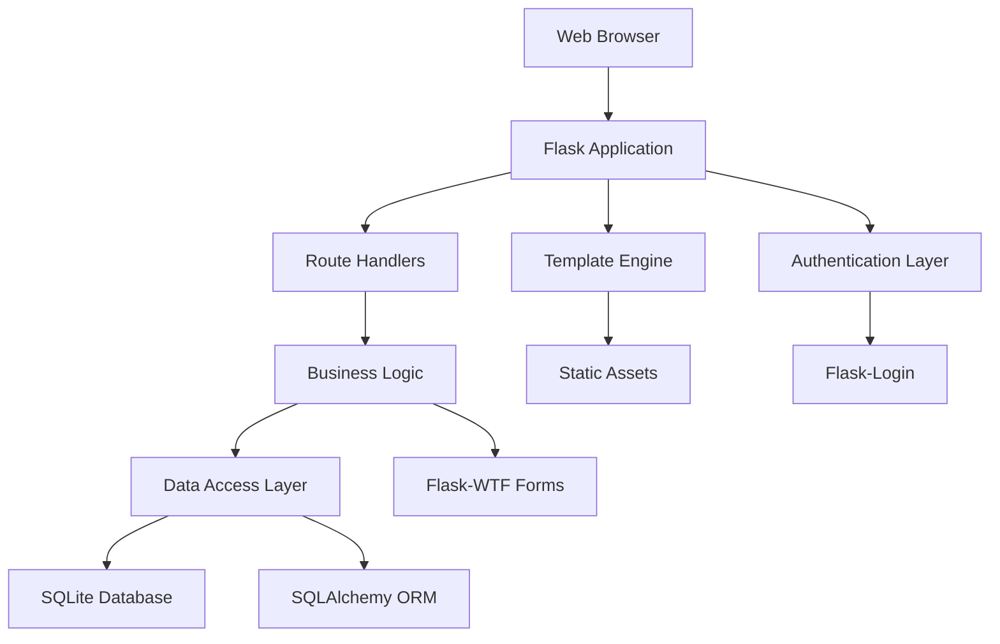
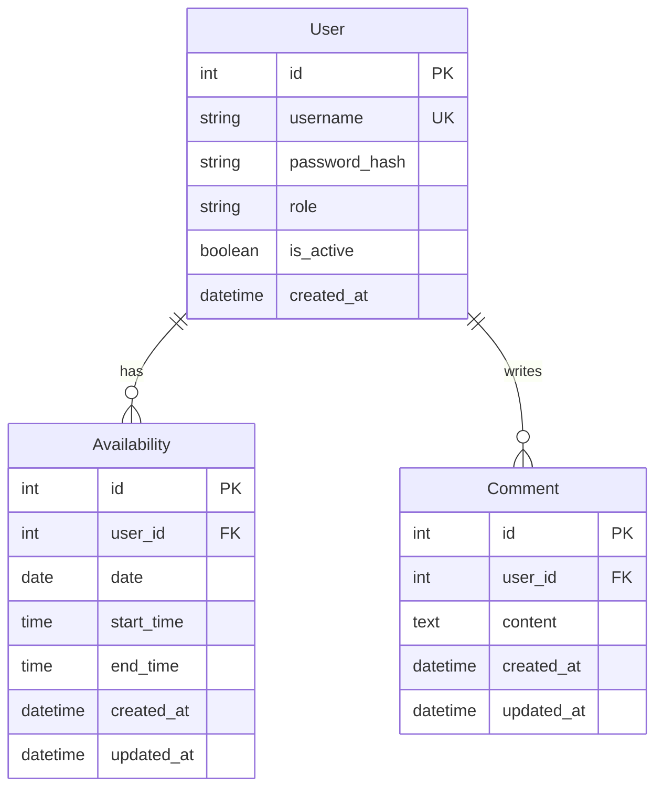

# Design Document

## Overview

The badminton availability management system is a web application built with Flask that provides role-based scheduling and communication features. The system uses a clean architecture with separation of concerns, implementing the Model-View-Controller pattern with Flask blueprints for modular organization.

The application serves two primary user types: regular Users who can manage their own availability and comments, and Admin users who have additional privileges for user management and content moderation. The system emphasizes security, usability, and mobile responsiveness with a distinctive black and fluorescent green theme.

## Architecture

### High-Level Architecture



### Technology Stack

- **Backend Framework**: Flask (Python web framework)
- **Database**: SQLite with SQLAlchemy ORM
- **Authentication**: Flask-Login for session management
- **Forms & Validation**: Flask-WTF with WTForms
- **Frontend**: HTML5 templates with Jinja2
- **Styling**: TailwindCSS with custom black/green theme
- **Date Handling**: Python datetime with HTML5 date/time inputs
- **Database Migrations**: Flask-Migrate

### Application Structure

```
app/
├── __init__.py              # Application factory
├── models.py               # SQLAlchemy models
├── forms.py                # WTForms form classes
├── routes/
│   ├── __init__.py
│   ├── auth.py             # Authentication routes
│   ├── availability.py     # Availability CRUD
│   ├── comments.py         # Comments CRUD
│   └── admin.py            # Admin-only routes
├── templates/
│   ├── base.html           # Base template
│   ├── dashboard.html      # User dashboard
│   ├── admin_dashboard.html # Admin dashboard
│   ├── auth/               # Login/register templates
│   ├── availability/       # Availability templates
│   ├── comments/           # Comment templates
│   └── admin/              # Admin templates
└── static/
    ├── css/                # TailwindCSS files
    ├── js/                 # JavaScript files
    └── img/                # Images and icons
```

## Components and Interfaces

### Core Models

#### User Model
```python
class User(UserMixin, db.Model):
    id = db.Column(db.Integer, primary_key=True)
    username = db.Column(db.String(80), unique=True, nullable=False)
    password_hash = db.Column(db.String(120), nullable=False)
    role = db.Column(db.String(20), nullable=False, default='User')
    is_active = db.Column(db.Boolean, default=True)
    created_at = db.Column(db.DateTime, default=datetime.utcnow)
    
    # Relationships
    availability_entries = db.relationship('Availability', backref='user', lazy=True)
    comments = db.relationship('Comment', backref='user', lazy=True)
```

#### Availability Model
```python
class Availability(db.Model):
    id = db.Column(db.Integer, primary_key=True)
    user_id = db.Column(db.Integer, db.ForeignKey('user.id'), nullable=False)
    date = db.Column(db.Date, nullable=False)
    start_time = db.Column(db.Time, nullable=False)
    end_time = db.Column(db.Time, nullable=False)
    created_at = db.Column(db.DateTime, default=datetime.utcnow)
    updated_at = db.Column(db.DateTime, default=datetime.utcnow, onupdate=datetime.utcnow)
```

#### Comment Model
```python
class Comment(db.Model):
    id = db.Column(db.Integer, primary_key=True)
    user_id = db.Column(db.Integer, db.ForeignKey('user.id'), nullable=False)
    content = db.Column(db.Text, nullable=False)
    created_at = db.Column(db.DateTime, default=datetime.utcnow)
    updated_at = db.Column(db.DateTime, default=datetime.utcnow, onupdate=datetime.utcnow)
```

### Route Blueprints

#### Authentication Blueprint (`auth.py`)
- `GET/POST /login` - User login
- `GET/POST /register` - User registration (Admin only)
- `GET /logout` - User logout
- Decorators for login_required and admin_required

#### Availability Blueprint (`availability.py`)
- `GET /` - Dashboard with today's availability (default view)
- `GET /availability` - Filtered availability view
- `POST /availability/add` - Add new availability
- `PUT /availability/<id>` - Edit availability (own only, or admin)
- `DELETE /availability/<id>` - Delete availability (own only, or admin)

#### Comments Blueprint (`comments.py`)
- `GET /comments` - View all comments
- `POST /comments/add` - Add new comment
- `PUT /comments/<id>` - Edit comment (own only, or admin)
- `DELETE /comments/<id>` - Delete comment (own only, or admin)

#### Admin Blueprint (`admin.py`)
- `GET /admin` - Admin dashboard
- `GET /admin/users` - User management interface
- `POST /admin/users/add` - Create new user
- `PUT /admin/users/<id>/toggle` - Block/unblock user
- `DELETE /admin/users/<id>` - Delete user

### Form Classes

#### Authentication Forms
```python
class LoginForm(FlaskForm):
    username = StringField('Username', validators=[DataRequired()])
    password = PasswordField('Password', validators=[DataRequired()])
    submit = SubmitField('Login')

class RegistrationForm(FlaskForm):
    username = StringField('Username', validators=[DataRequired(), Length(min=3, max=20)])
    password = PasswordField('Password', validators=[DataRequired(), Length(min=6)])
    role = SelectField('Role', choices=[('User', 'User'), ('Admin', 'Admin')])
    submit = SubmitField('Create User')
```

#### Availability Forms
```python
class AvailabilityForm(FlaskForm):
    date = DateField('Date', validators=[DataRequired()])
    start_time = TimeField('Start Time', validators=[DataRequired()])
    end_time = TimeField('End Time', validators=[DataRequired()])
    submit = SubmitField('Save Availability')
    
    def validate_date(self, field):
        if field.data <= date.today():
            raise ValidationError('Date must be in the future')
```

## Data Models

### Database Schema



### Data Validation Rules

1. **User Data**:
   - Username: 3-20 characters, unique, alphanumeric + underscore
   - Password: Minimum 6 characters, hashed with bcrypt
   - Role: Must be 'User' or 'Admin'

2. **Availability Data**:
   - Date: Must be future date only
   - Times: Valid time format, end_time > start_time
   - User can only modify their own entries (except Admin)

3. **Comment Data**:
   - Content: Non-empty, maximum 1000 characters
   - User can only modify their own comments (except Admin)

## Error Handling

### Application-Level Error Handling

1. **Authentication Errors**:
   - Invalid credentials: Flash message with retry option
   - Session timeout: Redirect to login with message
   - Unauthorized access: 403 error with explanation

2. **Validation Errors**:
   - Form validation: Display field-specific error messages
   - Date validation: Clear message about future-only dates
   - Time validation: Ensure logical time ranges

3. **Database Errors**:
   - Connection issues: Graceful degradation with user notification
   - Constraint violations: User-friendly error messages
   - Transaction rollback on failures

4. **HTTP Error Pages**:
   - 404: Custom page with navigation back to dashboard
   - 403: Access denied with role-appropriate messaging
   - 500: Generic error page with support contact

### Security Considerations

1. **Input Sanitization**: All user inputs validated and sanitized
2. **SQL Injection Prevention**: SQLAlchemy ORM with parameterized queries
3. **CSRF Protection**: Flask-WTF CSRF tokens on all forms
4. **Password Security**: Bcrypt hashing with salt
5. **Session Security**: Secure session cookies, proper logout

## Testing Strategy

### Unit Testing
- **Models**: Test all model methods, relationships, and validations
- **Forms**: Test form validation rules and custom validators
- **Utilities**: Test helper functions and decorators

### Integration Testing
- **Authentication Flow**: Login, logout, session management
- **CRUD Operations**: Create, read, update, delete for all entities
- **Role-Based Access**: Verify permission enforcement
- **Form Submissions**: End-to-end form processing

### Functional Testing
- **User Workflows**: Complete user journeys from login to task completion
- **Admin Workflows**: Administrative functions and user management
- **Cross-Browser**: Mobile responsiveness and browser compatibility
- **Security Testing**: Authentication bypass attempts, input validation

### Test Data Strategy
- **Fixtures**: Predefined test users, availability entries, comments
- **Factory Pattern**: Dynamic test data generation
- **Database Isolation**: Separate test database with cleanup

### UI/UX Design Specifications

#### Theme Implementation
- **Primary Colors**: 
  - Background: `#000000` (pure black)
  - Accent: `#00FF41` (fluorescent green)
  - Text: `#FFFFFF` (white) and `#00FF41` (green accents)
  - Secondary: `#1A1A1A` (dark gray for cards/sections)

#### Responsive Design
- **Mobile-First**: TailwindCSS responsive utilities
- **Breakpoints**: sm (640px), md (768px), lg (1024px), xl (1280px)
- **Touch-Friendly**: Minimum 44px touch targets
- **Readable Text**: Minimum 16px font size on mobile

#### Dashboard Layout
- **User Dashboard**: Clean grid layout with today's availability prominent
- **Admin Dashboard**: Additional admin panel with distinct visual indicators
- **Navigation**: Sticky header with role-appropriate menu items
- **Filters**: Intuitive date range, week, and month view toggles

This design provides a solid foundation for implementing the badminton availability management system with clear separation of concerns, robust security, and an excellent user experience.