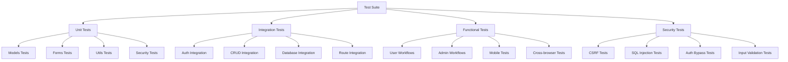
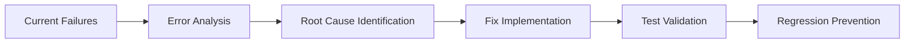
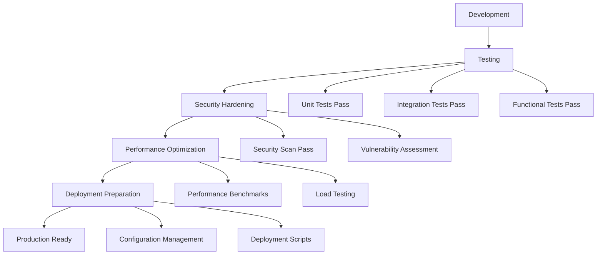

# Design Document

## Overview

The production testing readiness system is a comprehensive testing, debugging, and deployment preparation framework for the badminton scheduler application. This design addresses the current state where all 7 test suites are failing and transforms the application into a production-ready system with robust testing coverage, error resolution, security hardening, and deployment readiness.

The approach follows a systematic methodology: first fixing existing test failures, then enhancing test coverage, implementing security measures, optimizing performance, and finally preparing for production deployment. The design emphasizes maintainability, reliability, and user experience while keeping the application simple and intuitive.

## Architecture

### Testing Architecture



### Error Resolution Strategy



### Production Readiness Pipeline



## Components and Interfaces

### Test Framework Structure

#### Test Configuration (`conftest.py`)
```python
@pytest.fixture(scope='session')
def app():
    """Create application for testing"""
    app = create_app('testing')
    with app.app_context():
        db.create_all()
        yield app
        db.drop_all()

@pytest.fixture
def client(app):
    """Test client"""
    return app.test_client()

@pytest.fixture
def auth_headers(client):
    """Authentication headers for API testing"""
    # Login and return headers with session
    pass
```

#### Unit Test Structure
```python
# tests/unit/test_models.py
class TestUserModel:
    def test_user_creation(self):
        """Test user model creation and validation"""
        pass
    
    def test_password_hashing(self):
        """Test password hashing functionality"""
        pass
    
    def test_user_relationships(self):
        """Test user model relationships"""
        pass

# tests/unit/test_forms.py
class TestForms:
    def test_login_form_validation(self):
        """Test login form validation rules"""
        pass
    
    def test_availability_form_validation(self):
        """Test availability form custom validators"""
        pass
```

#### Integration Test Structure
```python
# tests/integration/test_auth_integration.py
class TestAuthIntegration:
    def test_login_logout_flow(self, client):
        """Test complete authentication flow"""
        pass
    
    def test_session_management(self, client):
        """Test session handling"""
        pass

# tests/integration/test_crud_integration.py
class TestCRUDIntegration:
    def test_availability_crud_flow(self, client, auth_headers):
        """Test complete CRUD operations"""
        pass
```

#### Functional Test Structure
```python
# tests/functional/test_user_workflows.py
class TestUserWorkflows:
    def test_complete_user_journey(self, client):
        """Test end-to-end user workflow"""
        pass
    
    def test_mobile_user_experience(self, client):
        """Test mobile-specific workflows"""
        pass
```

### Error Resolution Framework

#### Error Detection System
```python
class ErrorDetector:
    def __init__(self):
        self.errors = []
        self.warnings = []
    
    def scan_application(self):
        """Scan application for common issues"""
        self._check_imports()
        self._check_database_connections()
        self._check_route_definitions()
        self._check_template_rendering()
    
    def generate_report(self):
        """Generate comprehensive error report"""
        pass
```

#### Fix Implementation Strategy
1. **Import Errors**: Fix missing imports and circular dependencies
2. **Database Errors**: Resolve model relationships and migration issues
3. **Route Errors**: Fix route definitions and parameter handling
4. **Template Errors**: Resolve template syntax and variable issues
5. **Form Errors**: Fix form validation and CSRF issues

### Security Hardening Components

#### Input Validation Framework
```python
class SecurityValidator:
    @staticmethod
    def sanitize_input(input_data):
        """Sanitize user input to prevent XSS"""
        pass
    
    @staticmethod
    def validate_sql_injection(query):
        """Validate against SQL injection"""
        pass
    
    @staticmethod
    def check_csrf_token(request):
        """Validate CSRF token"""
        pass
```

#### Authentication Security
```python
class AuthSecurity:
    @staticmethod
    def hash_password(password):
        """Secure password hashing with bcrypt"""
        pass
    
    @staticmethod
    def validate_session(session_id):
        """Validate user session security"""
        pass
    
    @staticmethod
    def check_rate_limiting(user_id):
        """Implement rate limiting for login attempts"""
        pass
```

### Performance Optimization Components

#### Database Optimization
```python
class DatabaseOptimizer:
    def __init__(self, db):
        self.db = db
    
    def add_indexes(self):
        """Add database indexes for performance"""
        pass
    
    def optimize_queries(self):
        """Optimize database queries"""
        pass
    
    def implement_caching(self):
        """Implement query result caching"""
        pass
```

#### Response Optimization
```python
class ResponseOptimizer:
    @staticmethod
    def compress_responses():
        """Enable gzip compression"""
        pass
    
    @staticmethod
    def set_cache_headers():
        """Set appropriate cache headers"""
        pass
    
    @staticmethod
    def minify_assets():
        """Minify CSS and JavaScript"""
        pass
```

## Data Models

### Test Data Models

#### Test Fixtures
```python
class TestDataFactory:
    @staticmethod
    def create_test_user(username="testuser", role="User"):
        """Create test user with specified attributes"""
        return User(
            username=username,
            password_hash=generate_password_hash("testpass"),
            role=role,
            is_active=True
        )
    
    @staticmethod
    def create_test_availability(user, date=None):
        """Create test availability entry"""
        if not date:
            date = datetime.now().date() + timedelta(days=1)
        return Availability(
            user_id=user.id,
            date=date,
            start_time=time(9, 0),
            end_time=time(11, 0)
        )
```

#### Test Database Schema
- Separate test database configuration
- Isolated test data that doesn't affect development
- Automatic cleanup after test runs
- Consistent test data across test runs

### Error Tracking Models

#### Error Log Structure
```python
class ErrorLog:
    def __init__(self):
        self.timestamp = datetime.now()
        self.error_type = None
        self.error_message = None
        self.stack_trace = None
        self.request_info = None
        self.user_info = None
    
    def log_error(self, error, request=None, user=None):
        """Log error with context information"""
        pass
```

## Error Handling

### Comprehensive Error Resolution Strategy

#### Phase 1: Critical Error Resolution
1. **Import and Dependency Errors**
   - Fix missing imports in test files
   - Resolve circular import issues
   - Update requirements.txt with missing dependencies

2. **Database Connection Errors**
   - Fix database configuration issues
   - Resolve migration problems
   - Fix model relationship definitions

3. **Route and View Errors**
   - Fix route parameter handling
   - Resolve template rendering issues
   - Fix form processing errors

#### Phase 2: Test-Specific Error Resolution
1. **Unit Test Failures**
   - Fix model method implementations
   - Resolve form validation logic
   - Fix utility function implementations

2. **Integration Test Failures**
   - Fix authentication flow issues
   - Resolve CRUD operation problems
   - Fix database transaction handling

3. **Functional Test Failures**
   - Fix end-to-end workflow issues
   - Resolve mobile responsiveness problems
   - Fix cross-browser compatibility issues

#### Phase 3: Security Error Resolution
1. **CSRF Protection Issues**
   - Implement proper CSRF tokens
   - Fix form submission handling
   - Resolve AJAX request security

2. **Authentication Security Issues**
   - Fix password hashing implementation
   - Resolve session management problems
   - Implement proper authorization checks

### Error Prevention Strategies

#### Code Quality Measures
1. **Linting and Code Analysis**
   - Implement pylint/flake8 for code quality
   - Use black for code formatting
   - Implement pre-commit hooks

2. **Type Checking**
   - Add type hints to functions
   - Use mypy for static type checking
   - Implement runtime type validation

3. **Documentation Standards**
   - Add comprehensive docstrings
   - Document API endpoints
   - Create troubleshooting guides

## Testing Strategy

### Test Execution Framework

#### Test Runner Configuration
```python
# pytest.ini
[tool:pytest]
testpaths = tests
python_files = test_*.py
python_classes = Test*
python_functions = test_*
addopts = 
    --verbose
    --tb=short
    --cov=app
    --cov-report=html
    --cov-report=term-missing
```

#### Test Categories and Coverage

1. **Unit Tests (40% of total tests)**
   - Models: 100% method coverage
   - Forms: 100% validation coverage
   - Utilities: 100% function coverage
   - Security: 100% authentication coverage

2. **Integration Tests (35% of total tests)**
   - Authentication flows: Complete login/logout cycles
   - CRUD operations: Full database interaction testing
   - Route integration: All endpoint testing
   - Form processing: End-to-end form handling

3. **Functional Tests (20% of total tests)**
   - User workflows: Complete user journeys
   - Admin workflows: Administrative function testing
   - Mobile testing: Responsive design validation
   - Cross-browser: Compatibility verification

4. **Security Tests (5% of total tests)**
   - Vulnerability scanning: OWASP top 10 coverage
   - Penetration testing: Authentication bypass attempts
   - Input validation: Injection attack prevention
   - Session security: Session hijacking prevention

### Performance Testing Strategy

#### Load Testing Framework
```python
class LoadTester:
    def __init__(self, base_url):
        self.base_url = base_url
        self.session = requests.Session()
    
    def test_concurrent_users(self, num_users=50):
        """Test application under concurrent load"""
        pass
    
    def test_database_performance(self):
        """Test database query performance"""
        pass
    
    def measure_response_times(self):
        """Measure and report response times"""
        pass
```

#### Performance Benchmarks
- Page load time: < 2 seconds
- Database query time: < 100ms average
- API response time: < 500ms
- Concurrent user support: 100+ users
- Memory usage: < 512MB under normal load

### Mobile and Responsive Testing

#### Mobile Testing Framework
```python
class MobileTester:
    def __init__(self):
        self.screen_sizes = [
            (320, 568),  # iPhone SE
            (375, 667),  # iPhone 8
            (414, 896),  # iPhone 11
            (768, 1024), # iPad
        ]
    
    def test_responsive_layouts(self):
        """Test layouts across different screen sizes"""
        pass
    
    def test_touch_interactions(self):
        """Test touch-specific interactions"""
        pass
    
    def test_mobile_navigation(self):
        """Test mobile navigation usability"""
        pass
```

## Deployment Readiness

### Production Configuration

#### Environment Configuration
```python
class ProductionConfig:
    SECRET_KEY = os.environ.get('SECRET_KEY')
    DATABASE_URL = os.environ.get('DATABASE_URL')
    SQLALCHEMY_DATABASE_URI = DATABASE_URL
    SQLALCHEMY_TRACK_MODIFICATIONS = False
    
    # Security settings
    SESSION_COOKIE_SECURE = True
    SESSION_COOKIE_HTTPONLY = True
    SESSION_COOKIE_SAMESITE = 'Lax'
    
    # Performance settings
    SEND_FILE_MAX_AGE_DEFAULT = 31536000  # 1 year
```

#### Deployment Scripts
```bash
#!/bin/bash
# deploy.sh
set -e

echo "Starting deployment..."

# Install dependencies
pip install -r requirements.txt

# Run database migrations
flask db upgrade

# Run tests
python -m pytest tests/ -v

# Start application
gunicorn --bind 0.0.0.0:8000 run:app
```

### Monitoring and Logging

#### Application Monitoring
```python
class ApplicationMonitor:
    def __init__(self, app):
        self.app = app
        self.metrics = {}
    
    def track_response_time(self, endpoint, duration):
        """Track response times by endpoint"""
        pass
    
    def track_error_rate(self, error_type):
        """Track error rates by type"""
        pass
    
    def generate_health_report(self):
        """Generate application health report"""
        pass
```

#### Logging Configuration
```python
import logging
from logging.handlers import RotatingFileHandler

def setup_logging(app):
    if not app.debug:
        file_handler = RotatingFileHandler(
            'logs/application.log', 
            maxBytes=10240000, 
            backupCount=10
        )
        file_handler.setFormatter(logging.Formatter(
            '%(asctime)s %(levelname)s: %(message)s [in %(pathname)s:%(lineno)d]'
        ))
        file_handler.setLevel(logging.INFO)
        app.logger.addHandler(file_handler)
        app.logger.setLevel(logging.INFO)
```

This comprehensive design provides a systematic approach to transforming the failing badminton scheduler application into a production-ready system with robust testing, security, performance optimization, and deployment readiness.